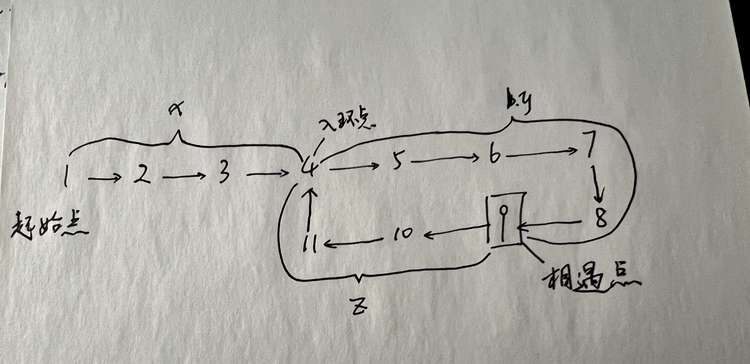

### 第一周：算法-链表篇（2.21-2.27）

#### 题目

- [LeetCode #142环形链表 II](https://leetcode-cn.com/problems/linked-list-cycle-ii/)

#### 思路1: 快慢指针



如上图，1为起始点，4为入环点，快指针走两步，慢指针走一步会在9相遇。这时候通过观察可以发现从起始点到入环点和从相遇点到入环点的距离是一样的。

为什么是一样的呢？这里可以进行一个简单的推导，我们假设起始点到入环点的距离为x，入环点到相遇点的距离为y，相遇点到入环点的距离为z，那么快指针一共走了x+n(y+z)+b，这的n表示走了几圈，慢指针一共走了x+y，因为快指针走两步，慢指针走一步，所以等式2(x+y) = x+n(y+z)+b，n我们不在乎。最后就会得到x = z， 即起始点到入环点和从相遇点到入环点的距离是一样的。

所以当快慢指针相遇后，将慢指针放到起始点，快指针不变，然后快慢指针都向前走一步，这样最后的相遇点就是入环点了

那么代码就可以这样实现：

```javascript
/**
 * Definition for singly-linked list.
 * function ListNode(val) {
 *     this.val = val;
 *     this.next = null;
 * }
 */

/**
 * @param {ListNode} head
 * @return {ListNode}
 */
 var detectCycle = function(head) {
   if (!head) return null
   let cur = head;
   let pre = head;
   while (cur && cur.next) {
     pre = pre.next;
     cur = cur.next.next;
     if (pre === cur) {
       // 当相遇后将慢指针从起始位置开始
      pre = head;
       while (pre !== cur) {
         // 慢指针从从起始位置开始移动一步，快指针也移动一步
         // 相遇点就是入环点
        pre = pre.next
        cur = cur.next
       }
       return pre
     }
   }
   return null;
};
```

最后，不懂快慢指针的可以看[[LeetCode #141环形链表](https://leetcode-cn.com/problems/linked-list-cycle/)](https://github.com/Mizxinp/weekly-frontend-interview/blob/main/category/algorithm/1Week-leetcode141.md)

#### 思路2

上一篇讲了判断链表是否有环讲到了可以使用标志位方式：[[LeetCode #141环形链表](https://leetcode-cn.com/problems/linked-list-cycle/)](https://github.com/Mizxinp/weekly-frontend-interview/blob/main/category/algorithm/1Week-leetcode141.md)

使用这种方式获取入环点就很简单了，当flag为true时，此时head就是入环点了

代码

```javascript
/**
 * Definition for singly-linked list.
 * function ListNode(val) {
 *     this.val = val;
 *     this.next = null;
 * }
 */

/**
 * @param {ListNode} head
 * @return {ListNode}
 */
var detectCycle = function (head) {
  while (head) {
    if (head.flag) {
      return head;
    } else {
      head.flag = true;
      head = head.next;
    }
  }
  return null;
};
```

