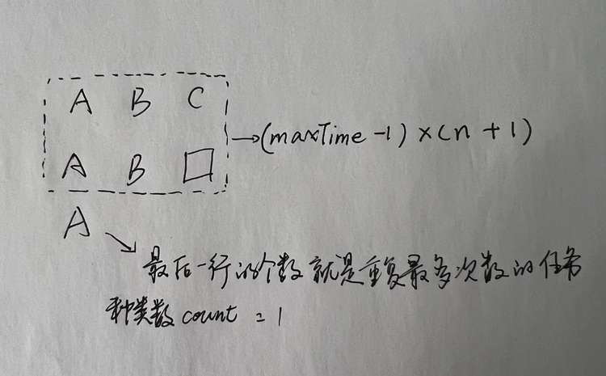

### 第6周：算法（3.28-4.3）

#### 题目（中等）

- [LeetCode #621 任务调度(中等)](https://leetcode-cn.com/problems/task-scheduler/)

#### 思路



可以比作是一个矩阵，矩阵列数为n+1，因为要保证相隔n个冷却时间，所以一行不能出现两次相同的任务.

如上图：

- 记录每个任务的次数，最多次的为maxTime，比如["A","A","A","B","B","C"]这个tasks的maxTime就是3
- 那么这个虚线框的面积就是：(maxTime - 1) * (n + 1)
- 最后一行剩下的个数就是重复最多次数的任务种类数，这里的例子count就是1
- 所有整个的时间就为：(maxTime - 1) * (n + 1) + count
- 另外一种情况就是(maxTime - 1) * (n + 1) + count的和比任务总次数少，那总时间就是tasks.length

代码：

```javascript
/**
 * @param {character[]} tasks
 * @param {number} n
 * @return {number}
 */
var leastInterval = function (tasks, n) {
  let taskMap = new Map();
  tasks.forEach((task) => {
    if (taskMap.has(task)) {
      const count = taskMap.get(task) + 1;
      taskMap.set(task, count);
    } else {
      taskMap.set(task, 1);
    }
  });
  // 出现最多次数的任务
  const maxTime = Math.max(...taskMap.values());
  // 重复最多次数的任务种类数
  let count = 0;
  taskMap.forEach(v => {
    if (v === maxTime) {
      count++
    }
  })
  return Math.max((maxTime - 1) * (n + 1) + count, tasks.length);
};

```
